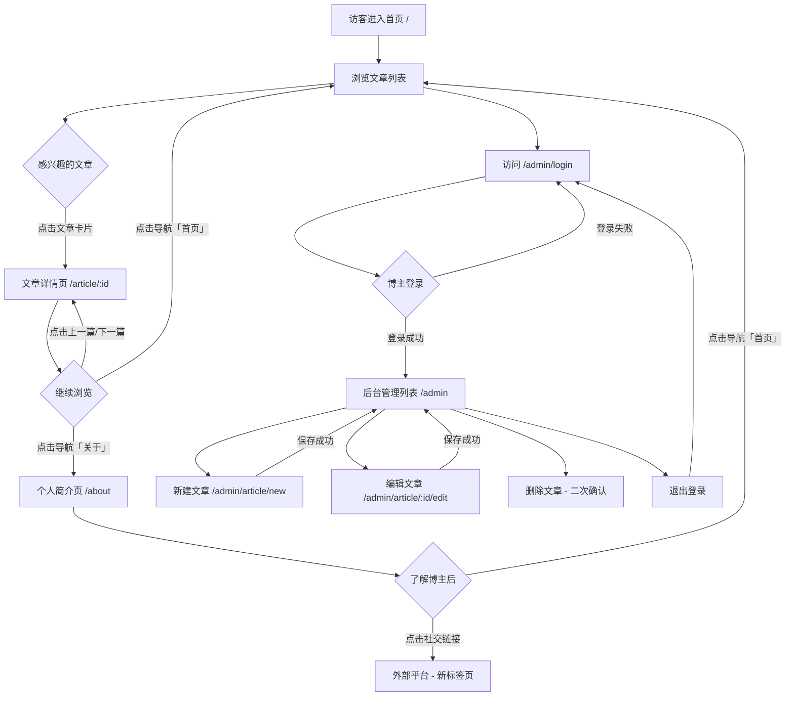

# 设计规范文档 v1.0
> 产品线：smoketest-p12 · 个人博客主页系统
> 选定风格：极简墨笔风（style-1）
> 设计日期：2026-04-06

---

## 一、五个设计问题（强制回答）

### 1. 谁在用？

**主要用户 A：博主（陈明轩，25-35 岁个人开发者）**
- 设备：笔记本电脑，桌面浏览器（Chrome/Safari 为主）
- 场景：专注写作、在安静环境中管理内容
- 心态：希望工具高效克制，不分散写作注意力
- 审美偏好：偏向简约、有品位，厌恶花哨设计

**次要用户 B：访客读者（林晓雯，20-40 岁技术爱好者）**
- 设备：手机（约 50%）+ 桌面（约 50%）
- 场景：通过搜索引擎或社交链接进入，快速浏览判断是否值得深读
- 心态：希望找到高质量内容，讨厌广告和视觉噪音
- 审美偏好：重视阅读体验，排版舒适度优先

### 2. 产品的气质是什么？

**极简东方主义 × 杂志编辑风**

不是冷峻的极简主义，而是带有温度的克制美学——像一本精心排版的技术读本，散发出沉静、专注、有品位的气质。受日本平面设计（田中一光）和欧洲杂志排版传统双重影响：大量留白创造呼吸感，字体差异建立信息层级，奶油白底色替代刺眼纯白，深森林绿代替惯用蓝色作为强调色。

核心情绪词：安静 · 专注 · 克制 · 可信赖 · 有品位

### 3. 用户打开页面的第一秒和第二秒应该被什么吸引？

**第一秒（视觉印象建立）：**
大面积奶油白底色 + 顶部极简导航条 + 博客名称的宋体大字渲染出一种「这不是普通博客」的第一印象。没有 Banner 图、没有轮播、没有广告位。视觉告诉用户：这里重视内容。

**第二秒（行动路径引导）：**
目光自然落到第一篇文章卡片的宋体标题上——标题大、字重足、留白充分，一眼可以判断是否感兴趣。鼠标 hover 时左侧出现 2px 深绿色边框线，明确提示「这是可点击的内容」。

### 4. 竞品的界面长什么样？我如何做到不同？

| 竞品 | 视觉特征 | 本设计的差异化策略 |
|------|----------|-------------------|
| 掘金 | 蓝白配色、信息密集、卡片有封面图、广告位明显 | 无广告位、无封面图、密度稀疏、奶油白 + 森林绿完全不同的色调 |
| CSDN | 大红色品牌色、UI 陈旧、信息混乱 | 极简排版、无侧栏广告、专注内容本身 |
| Hexo 默认主题 | 纯白 + 蓝色、过于通用、无个性 | 奶油白底 + 宋体字体塑造独特质感、深色模式重新设计而非反转 |

**核心差异**：在个人博客领域，「有品位的克制」本身就是稀缺的。大多数博客追求功能完整，本设计追求审美纯粹。

### 5. 目标平台的设计策略是什么？

**Web 端响应式设计策略（桌面优先）：**

- **桌面端（≥1024px）**：内容居中，最大宽度 760px，左右留白营造沉浸感，导航文字链接横排
- **平板端（768-1023px）**：与桌面端相近，间距稍微收紧
- **手机端（<768px）**：内容全宽（左右 padding 20px），导航链接压缩但不折叠（只有「首页」「关于」两个链接，完全放得下），字号下调

不涉及 iOS / Android 原生端设计。

---

## 二、用户流程图



---

## 三、页面信息架构

```
个人博客系统
├── 前台（公开）
│   ├── 首页 /               ← 文章列表 + 分页
│   ├── 文章详情 /article/:id ← 正文 + 元信息 + 前后导航
│   ├── 个人简介 /about       ← 头像 + 简介 + 联系方式
│   └── 错误页面
│       ├── 404.html
│       └── 500.html
└── 后台（需登录）
    ├── 登录 /admin/login
    ├── 文章管理列表 /admin
    ├── 新建文章 /admin/article/new
    └── 编辑文章 /admin/article/:id/edit
```

**页面跳转关系（原型中已实现的链接）：**

| 起始页面 | 触发元素 | 目标页面 |
|----------|----------|----------|
| index.html | 文章卡片点击 | article.html |
| index.html | 导航「关于」 | about.html |
| index.html | 分页按钮 | index.html（页码变化） |
| article.html | 导航「首页」 | index.html |
| article.html | 上一篇/下一篇 | article.html |
| about.html | 导航「首页」 | index.html |
| admin-login.html | 登录成功 | admin-articles.html |
| admin-articles.html | 「新建文章」 | admin-edit.html |
| admin-articles.html | 「编辑」 | admin-edit.html |
| admin-articles.html | 「退出登录」 | admin-login.html |
| admin-edit.html | 「保存」 | admin-articles.html |
| admin-edit.html | 「取消」 | admin-articles.html |

---

## 四、组件清单与交互说明

### 4.1 导航栏（前台）

**结构：** 博客名称（左）+ 导航链接（右）
**尺寸：** 高度 64px（桌面）/ 56px（移动）
**样式：** 背景 #F5F2EC，底部无分割线（靠留白与内容自然区隔）

**状态说明：**
| 状态 | 表现 |
|------|------|
| 默认 | 链接文字 #3D3D3D，字号 15px，思源宋体 |
| Hover | 文字变为 #2D6A4F（强调色），过渡 150ms ease-out |
| Active（当前页） | 文字 #1C1C1C，下方 2px 实线 #2D6A4F |

**移动端：** 链接横排，不折叠。只有「首页」「关于」两项，完全放得下。

---

### 4.2 文章卡片（文章列表页）

**结构：** 标题 + 摘要 + 元信息（日期 + 标签）
**边界：** 无描边卡片，靠上下间距（32px）自然分割。每张卡片宽度 100%（在 760px 容器内）。

**状态说明：**
| 状态 | 表现 |
|------|------|
| 默认 | 背景透明，标题 #1C1C1C，摘要 #6B6B6B |
| Hover | 左侧出现 2px 实线 #2D6A4F，背景微暖 → #EDE9E0，过渡 200ms ease-out，整体向右位移 6px（translateX） |
| Active | 背景 #E8E4D9，过渡 100ms ease-in |

---

### 4.3 分页控件

**桌面端：** 上一页 + 页码列表 + 下一页，居中排列
**移动端：** 仅「上一页」「下一页」两个按钮，全宽排列

**状态说明：**
| 状态 | 表现 |
|------|------|
| 默认页码 | 背景透明，文字 #3D3D3D |
| 当前页码 | 背景 #1C1C1C，文字 #F5F2EC，不可点击 |
| Hover 页码 | 背景 #EDE9E0 |
| 禁用（首页/末页） | 文字 #B0ADA5，cursor: not-allowed |

---

### 4.4 文章详情页（排版组件）

**文章标题：** 思源宋体 700，桌面 40px / 移动 28px，行高 1.15
**元信息行：** 日期 + 标签，霞鹜文楷 13px，颜色 #A0A09A，标题下方 spacing 12px
**分割线：** 元信息与正文之间 1px 实线 #E0DDD5，上下 margin 32px
**正文：** 霞鹜文楷 16px，行高 1.9，颜色 #3D3D3D，最大宽度 680px 居中
**代码块：** 背景 #EDE9E0，字体 'JetBrains Mono', monospace，字号 14px，圆角 6px，padding 16px
**前后导航：** 正文底部分割线后，「← 上一篇 / 下一篇 →」左右分布，悬停颜色 #2D6A4F

---

### 4.5 个人简介页布局

**桌面端不对称布局：** 左侧 30%（头像 + 社交链接）+ 右侧 70%（姓名 + 简介文字）
**移动端：** 竖向排列，头像居中，文字左对齐

**头像：**
- 尺寸：120×120px（桌面）/ 96×96px（移动）
- 圆形裁切，border: 3px solid #E0DDD5
- 加载失败时：显示文字占位符（姓名首字）

**社交链接图标：**
| 状态 | 表现 |
|------|------|
| 默认 | 图标 #A0A09A，文字 #6B6B6B |
| Hover | 图标 + 文字变为 #2D6A4F，translateY(-2px) |

---

### 4.6 后台文章管理列表

**布局：** 全宽表格，表头背景 #F5F2EC，行间用 1px #E0DDD5 分割
**操作列：** 「编辑」按钮（绿色边框）+ 「删除」按钮（红色文字）

**状态说明：**
| 状态 | 表现 |
|------|------|
| 表格行 Hover | 背景 #EDE9E0 |
| 已发布标签 | 背景 #D8F3DC，文字 #2D6A4F |
| 草稿标签 | 背景 #EDE9E0，文字 #A0A09A |
| 删除确认弹框 | 模态蒙层 rgba(0,0,0,0.4) + 确认卡片居中缩放出现 |

---

### 4.7 文章编辑表单

**字段顺序：** 标题 → 正文（textarea，min-height 320px）→ 标签 → 状态选择 → 操作按钮

**输入框通用规则：**
| 状态 | 表现 |
|------|------|
| 默认 | border: 1px solid #E0DDD5，背景 #FFFFFF，圆角 4px |
| Focus | border-color: #2D6A4F，box-shadow 0 0 0 3px rgba(45,106,79,0.15) |
| Error | border-color: #D62828，背景 rgba(214,40,40,0.04)，下方红色错误提示文字 |
| Disabled | 背景 #F5F2EC，文字 #A0A09A |

**按钮规则：**
| 类型 | 样式 | Hover | Active |
|------|------|-------|--------|
| 主按钮（发布） | 背景 #2D6A4F，文字白色，圆角 4px | 背景 #235840，translateY(-1px) | 背景 #1B4632，translateY(0) |
| 次按钮（草稿） | 背景 #F5F2EC，文字 #1C1C1C，边框 #E0DDD5 | 背景 #EDE9E0 | 背景 #E0DDD5 |
| 危险按钮（删除） | 文字 #D62828，无背景，无边框 | 背景 rgba(214,40,40,0.08) | 背景 rgba(214,40,40,0.15) |

---

### 4.8 登录表单

**布局：** 全屏居中，表单宽度 360px（桌面）/ 100% 横向 padding 24px（移动）
**背景：** 奶油白 #F5F2EC + 微妙的噪点纹理
**Logo/标题：** 博客名称宋体大字，位于表单上方 48px

**登录失败提示：**
- 表单上方出现橙红色背景提示条：「用户名或密码错误」
- 进入动画：从 translateY(-8px) 到 translateY(0)，200ms ease-out

---

## 五、目标平台差异说明（Web 端）

| 维度 | 桌面端（≥1024px） | 手机端（<768px） |
|------|------------------|-----------------|
| 容器最大宽度 | 760px 居中 | 100%，左右 padding 20px |
| 导航高度 | 64px | 56px |
| 文章标题字号 | H1: 40px，卡片标题: 24px | H1: 28px，卡片标题: 20px |
| 正文字号 | 16px | 15px |
| 分页 | 页码 + 上一页/下一页 | 仅上一页/下一页 |
| 简介页布局 | 30:70 不对称水平布局 | 垂直排列 |
| 后台表格 | 完整列展示 | 精简列（标题 + 状态 + 操作） |
| 最小点击区域 | 不限 | ≥44px |

---

## 六、动效规范

| 场景 | 动效描述 | 时长 | 缓动函数 |
|------|----------|------|----------|
| 页面加载 | 内容区域 staggered reveal（导航→标题→文章卡片依次淡入+上移） | 每项 300ms，间隔 80ms | ease-out |
| 文章卡片 hover | 左边框出现 + 背景色变化 + translateX(6px) | 200ms | ease-out |
| 按钮 hover | translateY(-1px) + 阴影加深 | 150ms | ease-out |
| 按钮 press | translateY(0) + 阴影消失 | 100ms | ease-in |
| 模态弹框出现 | 蒙层淡入 + 卡片 scale(0.95→1) + 淡入 | 200ms | cubic-bezier(0.34,1.56,0.64,1) |
| 深/浅色切换 | 全页 transition: all 300ms | 300ms | ease-in-out |
| Toast 提示 | 从顶部滑入 + 3s 后滑出 | 进 300ms / 出 200ms | ease-out / ease-in |
| 表单验证抖动 | translateX 左右抖动 3 次 | 400ms | 自定义 |

---

## 七、无障碍设计清单

- [x] 所有文字颜色符合 WCAG AA 标准（正文 #3D3D3D on #F5F2EC 对比度 ≈ 8.2:1）
- [x] 强调色 #2D6A4F on #F5F2EC 对比度 ≈ 5.1:1（满足 AA）
- [x] 所有交互元素有可见 focus 样式（绿色 outline）
- [x] 图片有 alt 属性（头像 alt="博主头像"，logo 有文字替代）
- [x] 表单有 label 与 input 的关联（for/id 配对）
- [x] 关键信息不仅靠颜色区分（草稿/发布标签附加文字）
- [x] 跳过导航链接（Skip to main content，视觉隐藏但键盘可访问）
- [x] 所有链接文字有意义（不使用「点击这里」）
- [x] 支持 prefers-reduced-motion：动效在用户开启减少动效时降级
- [x] 移动端 viewport meta 正确配置，触控区域 ≥44px
